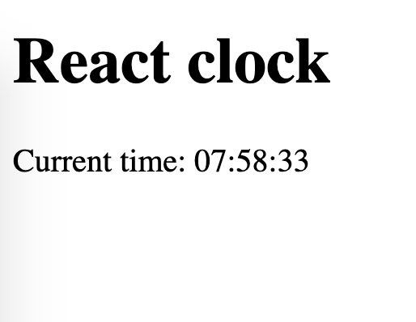

# React Clock
- Replace `<your_account>` with your Github username in the
 [DEMO LINK](https://Oleksandra-Pasenchenko.github.io/react_clock/)
- Follow the [React task guideline](https://github.com/mate-academy/react_task-guideline#react-tasks-guideline)
- Use [React TypeScript cheat sheet](https://mate-academy.github.io/fe-program/js/extra/react-typescript)

## Task
Create a Clock component updating the time every second.
- use class component
- start the timer only when the component is added to the page

## Lifecycle methods tasks
> Watch [this video](https://youtu.be/87RkHpYMDXI) to solve the next tasks

1. Add buttons `Show Clock` and `Hide Clock` in the App changing `isClockVisible` variable in the `App` state.
1. The `Clock` should not be rendered when `isClockVisible` is `false`.
1. Change the `Clock` component to print the time not only on the page but also in the `DevTools` console.
    - Stop the timer when the `Clock` is hidden.
1. Check if it works correctly:
    - Hide and show the `Clock` several times and leave it visible
    - The time in the console should be printed only once each second

## Prop update task
1. Add `Set random name` button to the `App` to set a random number as a `clockName` variable in the `App` state.
1. Pass the name to the `<Clock name={this.state.clockName} />`
1. Every time the `name` changes print a message in the console `The Clock was renamed from oldName to newName`.
    - Check if the message appears in the console between clock ticks
