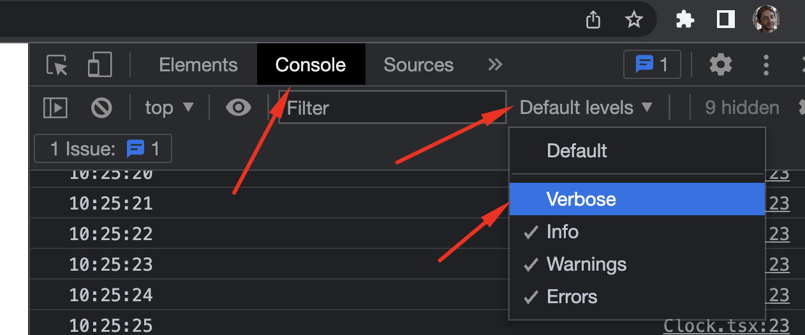
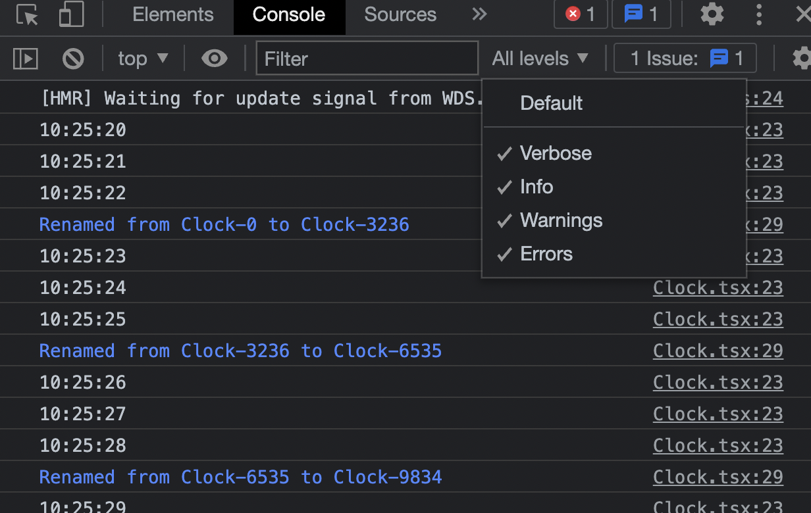

# React Clock

> [React + Typescript cheat sheet](https://mate-academy.github.io/fe-program/js/extra/react-typescript)

Create a `Clock` class component that will update the time every second using a given markup:

> Here is [the working version](https://mate-academy.github.io/react_clock)

- print current time on the page on page load;
  - use `.toUTCString().slice(-12, -4)` methods do avoid timezone issues;
- update the time every second using the `window.setInterval`;
- start the timer only when the component is added to the page (`componentDidMount`);
- every second print the time in the DevTools using `console.log` method;
- add the next comment above the console.debug line to ignore linter error
    ```js
    // eslint-disable-next-line no-console
    console.log('some message');
    ```
- make the `App` a class component;
- add the `hasClock` property to the `App` state;
- the `Clock` should be visible only when the `hasClock` is `true`;
- hide the `Clock` on a right mouse click in the `document` (`contextmenu` event):
    ```js
    document.addEventListener('contextmenu', (event: MouseEvent) => {
      event.preventDefault(); // not to show the context menu

      // put your code here
    });
    ```
- show the `Clock` on a left mouse click in the `document` (`click` event):
    ```js
    document.addEventListener('click', () => {});
    ```
- the time should not be printed to the console when the Clock is hidden (`componentWillUnmount`);
- add the `clockName` having `Clock-0` default value to the `App` state;
- pass it to the `Clock` to be shown near the time (see the markup):
    ```jsx
    <Clock name={this.state.clockName} />
    ```
- update the `clockName` every `3300ms` with a new value generated by existing `getRandomName` function;
- each time the name is changed, the `Clock` must print a message with an old name and a new name using the `console.debug` method (use `componentDidUpdate`):
    ```
    Renamed from oldName to newName
    ```
- to see `console.debug` messages enable the `verbose` level in DevTools console:



> check in the console that a renaming message occurs after each 3-4 time messages.



## Instructions
- Install Prettier Extention and use this [VSCode settings](https://mate-academy.github.io/fe-program/tools/vscode/settings.json) to enable format on save.
- Implement a solution following the [React task guideline](https://github.com/mate-academy/react_task-guideline#react-tasks-guideline).
- Use the [React TypeScript cheatsheet](https://mate-academy.github.io/fe-program/js/extra/react-typescript).
- Open one more terminal and run tests with `npm test` to ensure your solution is correct.
- Replace `<your_account>` with your Github username in the [DEMO LINK](https://shelyaa.github.io/react_clock/) and add it to the PR description.
